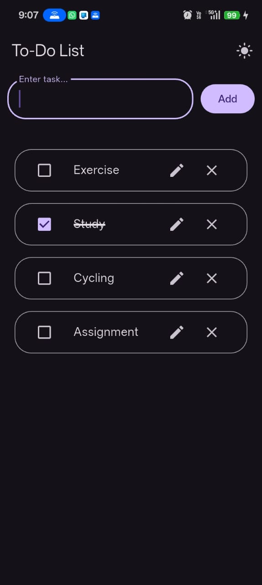
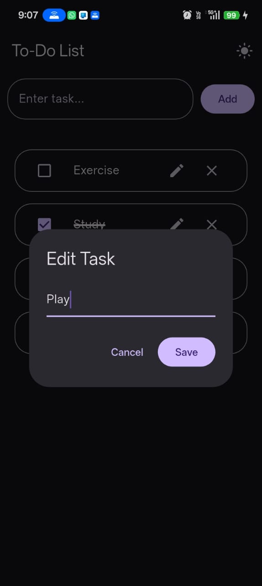

# ✅ Todo-List 

A clean and responsive **Flutter To-Do application** that helps users organize daily tasks with persistent local storage. The app supports task creation, editing, deletion, completion tracking, and dark mode, with all data saved locally using SharedPreferences.

## ✨ Features

- ➕ Add new tasks
- ✏️ Edit existing tasks
- ❌ Delete tasks
- ☑️ Mark tasks as completed
- 💾 Persistent local storage using SharedPreferences
- 🌙 Light & Dark mode
- 🎨 Clean and responsive Material Design UI

## 📸 Screenshots

<p align="center">
  
  
  
</p>

## 🛠️ Tech Stack

- Flutter
- Dart
- SharedPreferences
- Material Design

## 🚀 Getting Started

Clone the repository:

```bash
git clone https://github.com/zohras0112-ux/to_do_list_pro.git
```

Install dependencies:

```bash
flutter pub get
```

Run the application:

```bash
flutter run
```

## 📂 Project Structure

```text
lib/
├── data/
│   ├── service/
|   |    ├── preference.dart
|   ├── models/
│       ├── task.dart
├── views/
│   ├── pages/
│   │   ├── home_page.dart
│   │   └── widget_tree.dart
│   └── widgets/
│       ├── add_task_widget.dart
│       ├── edit_task_widget.dart
│       └── task_tile.dart
└── main.dart
```

## 📄 License

This project was built for learning, portfolio, and educational purposes.
